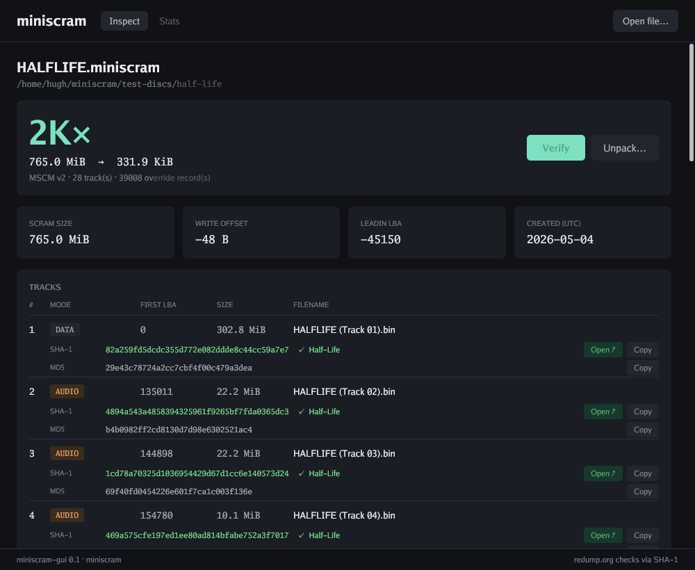
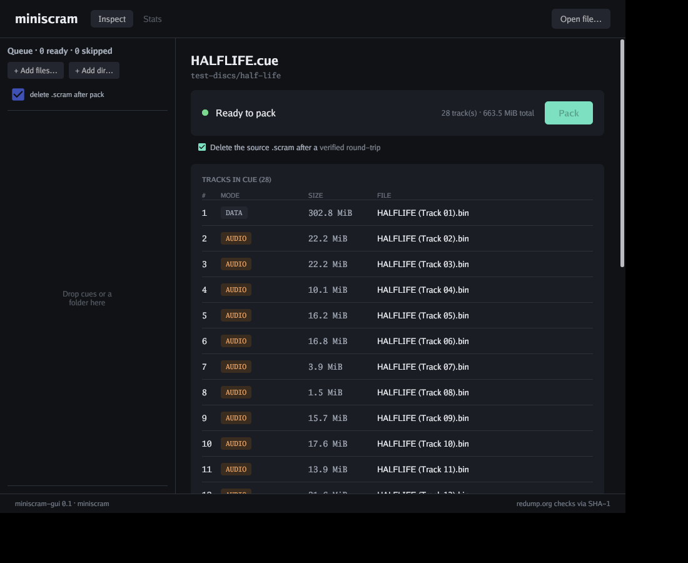
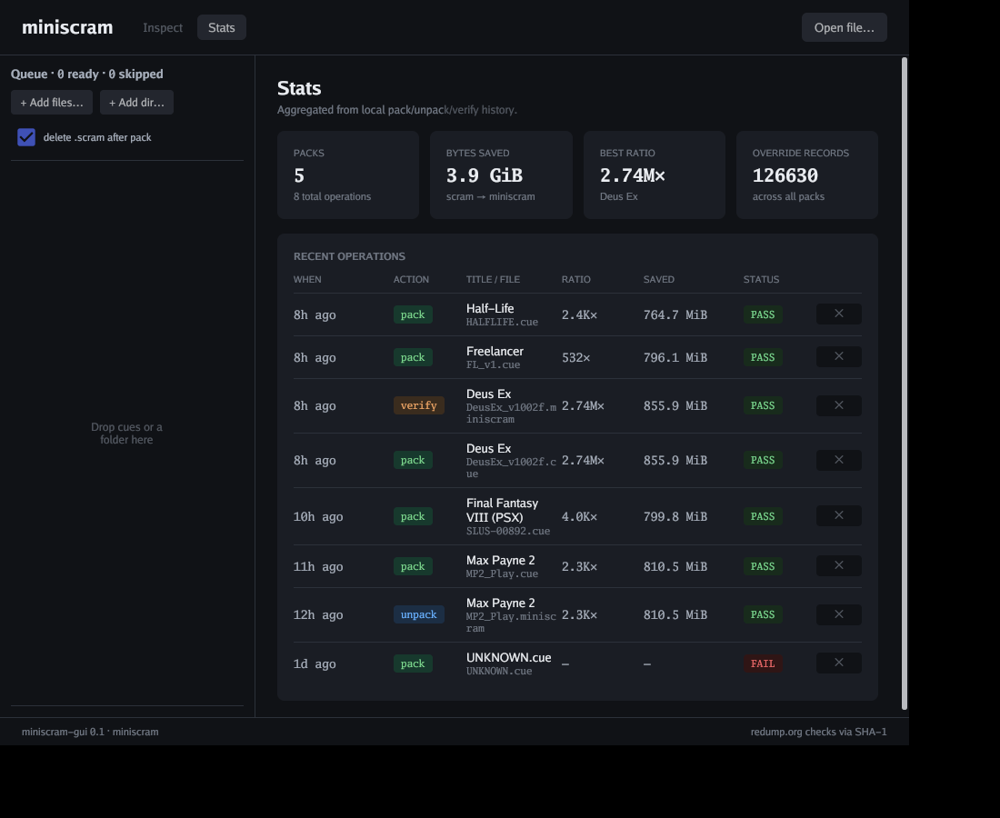
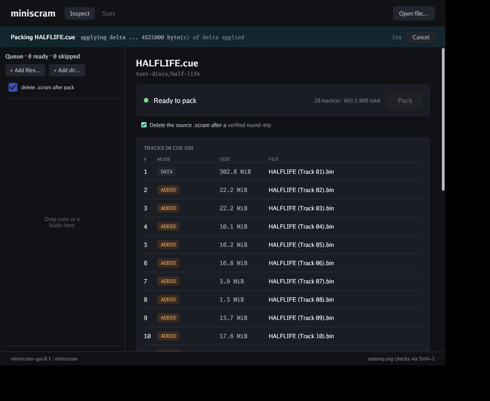
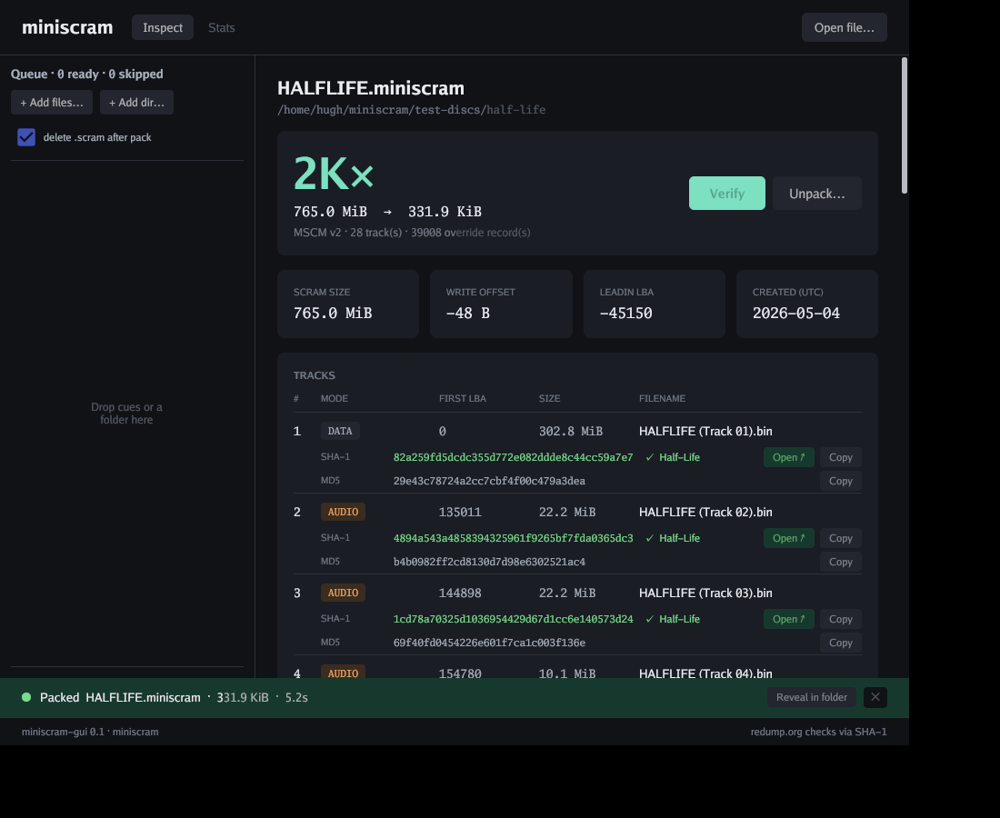

# tools/miniscram-gui

A small desktop wrapper around the `miniscram` CLI. Single Go binary,
own `go.mod` (matching the pattern of `scripts/sweep`) so the main
`miniscram` build doesn't pull Gio + sqlite into its dep graph.

## What it does

- Loads a `.miniscram` (read-only inspect) or a `.cue` (ready to pack)
  via a native OS file dialog.
- Renders the manifest as a desktop UI: hero compression ratio,
  stat tiles, tracks table with per-track hashes and a Copy button.
- Looks each track's SHA-1 up at redump.org (`/discs/quicksearch/<hash>/`)
  with a User-Agent identifying the GUI, and turns the row green
  with an "Open ↗" link when matched. Cached per-hash in SQLite.
- For cuesheets: shows referenced bin sizes and warns if any are
  missing or if the sibling `.scram` is absent.
- Records every pack/unpack/verify (success, fail, or cancelled) in
  a local SQLite, surfaced in a Stats tab — totals, best ratio,
  recent operations with a per-row delete.
- Pack / Verify / Unpack run as cancellable subprocesses with a
  running-state strip showing the current step + elapsed time, and
  a 6-second success toast with a Reveal-in-folder button.
- Drop a folder of cues (or multiple cues) onto the window — or use
  the queue panel's `+ Add files…` / `+ Add dir…` buttons — and they
  pack sequentially in a left-hand queue. Per-row green progress fill,
  per-row remove (`×`), cancel-current (`⏹`), and Stop queue. The
  right pane auto-follows the running cue unless you click somewhere
  else; clicking the running row re-engages auto-follow.

The GUI talks to `miniscram` strictly by shelling out (`miniscram
inspect --json` for metadata, `miniscram pack/unpack/verify` for
actions) — no library import. See issue #18 for the discussion.

## Build

Native deps come from a Nix shell on Linux dev. On a real desktop
the system X11/Wayland + GL + a C toolchain are sufficient.

    nix-shell ../../shell.nix --run 'go build -o miniscram-gui .'

## Storage

| What                          | Where                                                |
|-------------------------------|------------------------------------------------------|
| Redump cache + history events | `$XDG_DATA_HOME/miniscram-gui/db.sqlite`             |

## Flags

| Flag                     | Purpose                                                                         |
|--------------------------|---------------------------------------------------------------------------------|
| `-load <path>`           | Auto-load a file at startup (used in screenshots).                              |
| `-view stats`            | Open straight on the Stats tab.                                                 |
| `-seed`                  | Insert a small set of fixture events so Stats demos well.                       |
| `-mock-running <action>` | Screenshot-only: inject a fake in-flight action (`pack`/`unpack`/`verify`).     |
| `-mock-toast <action>`   | Screenshot-only: inject a fake success toast (`pack`/`unpack`/`verify`).        |

## Screenshots

A `.miniscram` loaded — hero compression ratio, stat tiles, tracks
with per-track hashes (each row green when matched on redump.org,
linked to the disc page):

A `.cue` loaded — status banner, tracks parsed from the cue with bin
sizes, default-on checkbox to delete `.scram` after a verified pack:

Stats tab — totals, best ratio, recent operations table with a
per-row delete:

Pack/unpack/verify run as cancellable subprocesses with a running
strip showing the current step + elapsed time:

…and a 6 s success toast with a Reveal-in-folder button:

